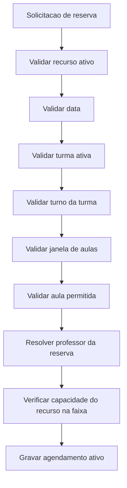
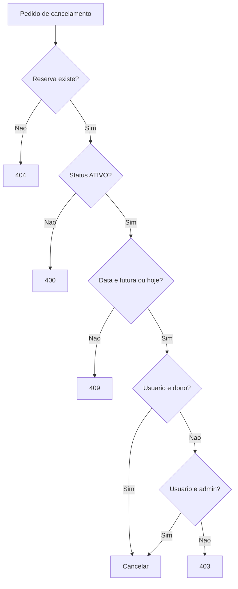

# Regras de Negocio: Agendamento

## Objetivo

Este documento lista as regras de negocio confirmadas no codigo do modulo de agendamento.

## Resumo Das Regras

## Regras De Criacao

### Recurso Precisa Existir E Estar Ativo

Ao criar uma reserva, o recurso e buscado por id e precisa estar ativo. Caso contrario, a criacao e recusada com erro `404`.

Base:

- `modules/scheduling/service.py`: `create_scheduling_reservation`
- `modules/scheduling/service.py`: `ensure_resource_is_active`
- `modules/scheduling/repository.py`: `get_resource`

Classificacao: Confirmada pelo codigo.

### Data Deve Usar Formato ISO

A data de agendamento deve estar no formato `YYYY-MM-DD`.

Base:

- `modules/scheduling/policies.py`: `validar_data_agendamento`
- `modules/scheduling/service.py`: `build_reservation_creation_payload`

Classificacao: Confirmada pelo codigo.

### Periodo De Consulta Nao Pode Ter Inicio Apos O Fim

Na listagem de reservas, quando `data_inicio` e `data_fim` sao informadas, a data inicial nao pode ser maior que a final.

Base:

- `modules/scheduling/service.py`: `validate_scheduling_period`
- `modules/scheduling/router.py`: `listar_reservas_agendamento`

Classificacao: Confirmada pelo codigo.

### Turma Precisa Ser Ativa

A turma informada precisa existir na lista de turmas ativas.

Base:

- `modules/scheduling/policies.py`: `validar_turma`
- `modules/scheduling/repository.py`: `list_active_classes`

Classificacao: Confirmada pelo codigo.

### Turma Precisa Ter Turno Configurado

Depois de validar a turma, o turno dela precisa existir em `TURNOS_CONFIG`.

Base:

- `modules/scheduling/service.py`: `ensure_class_shift_is_configured`
- `modules/scheduling/config.py`: `TURNOS_CONFIG`

Classificacao: Confirmada pelo codigo.

### Tema Da Aula E Obrigatorio

O tema da aula nao pode ser vazio.

Base:

- `modules/scheduling/policies.py`: `validar_tema_aula`
- `modules/scheduling/service.py`: `build_reservation_creation_payload`

Classificacao: Confirmada pelo codigo.

### Aula Precisa Ser Numerica E Positiva

A aula informada precisa ser um numero inteiro positivo.

Base:

- `modules/scheduling/policies.py`: `validar_aula`

Classificacao: Confirmada pelo codigo.

### Aula Precisa Estar Dentro Da Janela Da Turma

Quando ha grade global configurada, a aula deve estar entre a aula inicial e final permitidas para a turma.

Base:

- `modules/scheduling/policies.py`: `validar_aula`
- `modules/scheduling/service.py`: `ensure_class_lesson_window_is_configured`
- `modules/scheduling/lesson_config.py`: `resolve_class_lesson_window`
- `modules/scheduling/lesson_config.py`: `list_lessons_for_class`

Classificacao: Confirmada pelo codigo.

### Grade Global Precisa Ter Aulas Ativas

Se a turma nao tiver aulas disponiveis e nao houver aulas globais configuradas, a criacao e recusada com erro orientando cadastro no painel admin.

Base:

- `modules/scheduling/service.py`: `ensure_class_lesson_window_is_configured`
- `modules/scheduling/policies.py`: `validar_aula`
- `modules/scheduling/lesson_config.py`: `total_configured_lessons`

Classificacao: Confirmada pelo codigo.

### Capacidade Do Recurso Controla Concorrencia Na Faixa

O sistema conta reservas ativas para o mesmo recurso, data e faixa global. Se o total ja for maior ou igual a `quantidade_itens`, a reserva e recusada.

Base:

- `modules/scheduling/service.py`: `ensure_slot_has_capacity`
- `modules/scheduling/service.py`: `create_scheduling_reservation`
- `modules/scheduling/repository.py`: `count_active_reservations_in_slot`
- `database.py`: `contar_agendamentos_ativos_faixa`

Classificacao: Confirmada pelo codigo.

### Capacidade Minima Do Recurso E Um

Mesmo que o valor de `quantidade_itens` venha ausente ou menor que um, o dominio normaliza a capacidade para pelo menos `1`.

Base:

- `modules/scheduling/models.py`: `SchedulingResource.from_dict`
- `modules/scheduling/service.py`: `ensure_slot_has_capacity`

Classificacao: Confirmada pelo codigo.

### Professor Da Reserva

Se `professor_id` nao for informado, a reserva fica associada ao usuario logado. Se `professor_id` for informado, o usuario selecionado precisa existir e ser professor.

Base:

- `routers/common.py`: `resolver_usuario_professor_selecionado`
- `modules/scheduling/service.py`: `build_reservation_creation_payload`

Classificacao: Confirmada pelo codigo.

### Apenas Admin Seleciona Outro Professor No Fluxo Atual

No fluxo atual, informar `professor_id` exige admin, salvo quando a funcao compartilhada recebe permissao explicita para professor com acesso de coordenacao. O agendamento nao passa essa permissao explicita.

Base:

- `routers/common.py`: `resolver_usuario_professor_selecionado`
- `modules/scheduling/service.py`: `build_reservation_creation_payload`

Classificacao: Confirmada pelo codigo.

## Regras De Cancelamento

### Reserva Precisa Existir

Cancelamento de reserva inexistente retorna erro.

Base:

- `modules/scheduling/service.py`: `ensure_reservation_can_be_cancelled`
- `modules/scheduling/repository.py`: `get_reservation`

Classificacao: Confirmada pelo codigo.

### Reserva Precisa Estar Ativa

Reserva com status diferente de `ATIVO` nao pode ser cancelada novamente.

Base:

- `modules/scheduling/service.py`: `ensure_reservation_can_be_cancelled`

Classificacao: Confirmada pelo codigo.

### Data Da Reserva Precisa Ser Valida

O cancelamento tenta converter a data da reserva no formato `%Y-%m-%d`.

Base:

- `modules/scheduling/service.py`: `ensure_reservation_can_be_cancelled`

Classificacao: Confirmada pelo codigo.

### Nao E Permitido Cancelar Data Passada

Reservas com data anterior ao dia atual nao podem ser canceladas.

Base:

- `modules/scheduling/service.py`: `ensure_reservation_can_be_cancelled`

Classificacao: Confirmada pelo codigo.

### Apenas Dono Ou Admin Cancela

O usuario logado pode cancelar a propria reserva. Admin pode cancelar reserva de outro usuario.

Base:

- `modules/scheduling/service.py`: `ensure_reservation_can_be_cancelled`
- `modules/scheduling/router.py`: `cancelar_reserva_agendamento`
- `modules/scheduling/dependencies.py`: `user_is_admin_for_scheduling`

Classificacao: Confirmada pelo codigo.

## Regras De Grade E Turnos

### Turnos Configurados

Os turnos conhecidos sao:

- `INTEGRAL`
- `MATUTINO`
- `VESPERTINO`
- `VESPERTINO_EM`

Base:

- `modules/scheduling/config.py`: `TURNOS_CONFIG`

Classificacao: Confirmada pelo codigo.

### Janelas Padrao De Aulas Por Turno

O sistema define janelas padrao de aulas por turno para resolver classes sem janela explicita.

Base:

- `modules/scheduling/config.py`: `JANELA_AULAS_PADRAO_POR_TURNO`
- `modules/scheduling/lesson_config.py`: `lesson_window_from_turn`
- `modules/scheduling/lesson_config.py`: `resolve_class_lesson_window`

Classificacao: Confirmada pelo codigo.

### Segmentos De Faixa Global Por Turno

O turno integral aceita as faixas `1-5` e `7-9`, pulando a faixa `6`.

Base:

- `modules/scheduling/config.py`: `SEGMENTOS_FAIXA_GLOBAL_POR_TURNO`
- `modules/scheduling/lesson_config.py`: `lesson_number_is_allowed_for_turn`
- `tests/test_scheduling_service.py`: `test_integral_skips_global_slot_six_and_starts_afternoon_at_seven`

Classificacao: Confirmada pelo codigo.

### Labels De Aula

A configuracao global gera labels curtas e completas com nome e horario.

Base:

- `modules/scheduling/lesson_config.py`: `build_lesson_display_label`
- `modules/scheduling/lesson_config.py`: `normalize_schedule_entries`
- `tests/test_scheduling_service.py`: `test_normalize_schedule_entries_uses_admin_lesson_name_in_labels`

Classificacao: Confirmada pelo codigo.

## Regras De Permissao

| Regra | Base no codigo | Classificacao |
| --- | --- | --- |
| Endpoints de agendamento exigem usuario logado | `modules/scheduling/router.py`: uso de `Depends(get_usuario_logado)` | Confirmada pelo codigo |
| Listar professores exige admin ou usuario apto a gerir | `modules/scheduling/router.py`: `professores_agendamento`; `routers/common.py`: `usuario_pode_gerir_impressoes` | Confirmada pelo codigo |
| Selecionar outro professor exige admin no fluxo atual | `routers/common.py`: `resolver_usuario_professor_selecionado` | Confirmada pelo codigo |
| Configuracao de aulas no admin exige gestor | `routers/admin_router.py`: `listar_configuracao_aulas_admin`, `criar_configuracao_aulas_admin`, `atualizar_configuracao_aulas_admin` | Confirmada pelo codigo |

## Regras De Auditoria

A criacao de reserva registra evento de auditoria tanto em sucesso quanto em falha por `HTTPException`.

Base:

- `modules/scheduling/router.py`: `criar_reserva_agendamento`
- `modules.audit.service`: `record_event`
- `modules.audit.models`: `AuditCategory`, `AuditOutcome`

Classificacao: Confirmada pelo codigo.

## Duvidas Pendentes

| Duvida | Evidencia | Classificacao |
| --- | --- | --- |
| Coordenador deve conseguir agendar para outro professor? | `professores_agendamento` permite consulta por gestor, mas `resolver_usuario_professor_selecionado` exige admin para `professor_id` no fluxo atual | Pendente de validacao |
| A tabela `configuracao_turnos_segmentos` deve influenciar regras em runtime? | Migration cria a tabela, mas `lesson_number_is_allowed_for_turn` usa constantes | Pendente de validacao |

