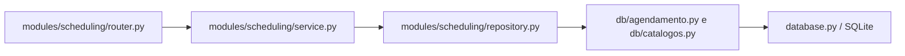
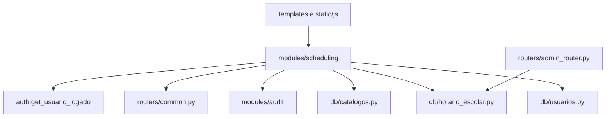

# Modulo de Agendamento

## Objetivo

O modulo de agendamento permite que usuarios autenticados reservem recursos escolares por data, turma, aula, professor, tema e observacao. Ele tambem expoe consultas de recursos, opcoes de grade, professores e reservas.

Esta documentacao registra o estado atual do codigo. Ela nao descreve uma arquitetura desejada futura.

## Localizacao

Arquivos principais do backend:

- `modules/scheduling/router.py`
- `modules/scheduling/service.py`
- `modules/scheduling/repository.py`
- `modules/scheduling/schemas.py`
- `modules/scheduling/models.py`
- `modules/scheduling/policies.py`
- `modules/scheduling/lesson_config.py`
- `modules/scheduling/config.py`
- `modules/scheduling/dependencies.py`

Arquivos relacionados:

- `routers/pages_router.py`
- `routers/admin_router.py`
- `routers/common.py`
- `db/agendamento.py`
- `db/catalogos.py`
- `db/horario_escolar.py`
- `db/usuarios.py`
- `database.py`
- `templates/scheduling/index.html`
- `templates/scheduling/my_bookings.html`
- `templates/scheduling/calendar.html`
- `templates/includes/scheduling_repeat_step.html`
- `static/js/agendamento.js`
- `static/js/scheduling/day_overview.js`
- `static/js/scheduling/repeat_step.js`

## Situacao Arquitetural

O modulo ja segue em grande parte o fluxo modular:

O modulo tambem depende de componentes compartilhados para autenticacao, permissao, auditoria, catalogos e configuracao de aulas.

## Atores

| Ator | Papel no modulo | Base no codigo | Classificacao |
| --- | --- | --- | --- |
| Usuario autenticado | Pode acessar endpoints de recursos, opcoes e reservas | `modules/scheduling/router.py`: `recursos_agendamento`, `opcoes_agendamento`, `listar_reservas_agendamento` | Confirmada pelo codigo |
| Professor | Pode criar reserva para si quando `professor_id` nao e informado | `routers/common.py`: `resolver_usuario_professor_selecionado`; `modules/scheduling/service.py`: `build_reservation_creation_payload` | Confirmada pelo codigo |
| Admin | Pode selecionar outro professor e cancelar reserva de terceiros | `routers/common.py`: `resolver_usuario_professor_selecionado`; `modules/scheduling/service.py`: `ensure_reservation_can_be_cancelled` | Confirmada pelo codigo |
| Gestor/coordenador | Pode consultar lista de professores se passar pela permissao de gestao | `modules/scheduling/router.py`: `professores_agendamento`; `routers/common.py`: `usuario_pode_gerir_impressoes` | Confirmada pelo codigo |

## Endpoints

| Metodo | Rota | Funcao | Responsabilidade | Classificacao |
| --- | --- | --- | --- | --- |
| GET | `/agendamento` | `routers/pages_router.py`: `agendamento_page` | Renderiza a tela HTML do agendamento | Confirmada pelo codigo |
| GET | `/agendamento/meus-agendamentos` | `modules/scheduling/router.py`: `my_scheduling_page` | Renderiza os agendamentos do usuario | Confirmada pelo codigo |
| GET | `/agendamento/calendario` | `modules/scheduling/router.py`: `scheduling_calendar_page` | Renderiza o calendario geral | Confirmada pelo codigo |
| GET | `/agendamento/recursos` | `modules/scheduling/router.py`: `recursos_agendamento` | Lista recursos ativos | Confirmada pelo codigo |
| GET | `/agendamento/opcoes` | `modules/scheduling/router.py`: `opcoes_agendamento` | Retorna turnos, grade, aulas globais e turmas | Confirmada pelo codigo |
| GET | `/agendamento/professores` | `modules/scheduling/router.py`: `professores_agendamento` | Lista professores disponiveis para agendamento | Confirmada pelo codigo |
| GET | `/agendamento/reservas` | `modules/scheduling/router.py`: `listar_reservas_agendamento` | Lista reservas por periodo e recurso opcional | Confirmada pelo codigo |
| POST | `/agendamento/reservas` | `modules/scheduling/router.py`: `criar_reserva_agendamento` | Cria reserva e registra auditoria | Confirmada pelo codigo |
| POST | `/agendamento/reservas/{agendamento_id}/cancelar` | `modules/scheduling/router.py`: `cancelar_reserva_agendamento` | Cancela reserva | Confirmada pelo codigo |
| GET | `/admin/configuracao-aulas` | `routers/admin_router.py`: `listar_configuracao_aulas_admin` | Lista configuracao global de aulas | Confirmada pelo codigo |
| POST | `/admin/configuracao-aulas` | `routers/admin_router.py`: `criar_configuracao_aulas_admin` | Cria item da grade global | Confirmada pelo codigo |
| PUT | `/admin/configuracao-aulas/{configuracao_id}` | `routers/admin_router.py`: `atualizar_configuracao_aulas_admin` | Atualiza item da grade global | Confirmada pelo codigo |

## Entidades

### SchedulingResource

Representa um recurso reservavel.

Base:

- `modules/scheduling/models.py`: `SchedulingResource`
- `modules/scheduling/schemas.py`: `SchedulingResourceOption`

Campos principais:

- `id`
- `nome`
- `tipo`
- `descricao`
- `quantidade_itens`
- `imagem_capa`
- `ativo`

Classificacao: Confirmada pelo codigo.

### SchedulingReservation

Representa uma reserva de recurso.

Base:

- `modules/scheduling/models.py`: `SchedulingReservation`
- `modules/scheduling/schemas.py`: `SchedulingReservationOut`
- `modules/scheduling/schemas.py`: `SchedulingReservationCreate`

Campos principais:

- `id`
- `recurso_id`
- `usuario_id`
- `data`
- `turno`
- `aula`
- `faixa_global`
- `turma`
- `tema_aula`
- `observacao`
- `status`
- `criado_em`
- `cancelado_em`

Classificacao: Confirmada pelo codigo.

### Configuracao de Aula

Representa itens da grade global usados para montar as aulas disponiveis por turma.

Base:

- `modules/scheduling/schemas.py`: `SchedulingLessonConfigIn`, `SchedulingLessonConfigOut`
- `modules/scheduling/lesson_config.py`: `normalize_schedule_entries`, `list_global_lessons`, `list_lessons_for_class`
- `routers/admin_router.py`: `listar_configuracao_aulas_admin`, `criar_configuracao_aulas_admin`, `atualizar_configuracao_aulas_admin`

Classificacao: Confirmada pelo codigo.

## Tabelas

| Tabela | Uso no agendamento | Base no codigo | Classificacao |
| --- | --- | --- | --- |
| `agendamentos` | Armazena reservas | `database.py`: `criar_tabelas`, `criar_agendamento`, `listar_agendamentos`, `cancelar_agendamento` | Confirmada pelo codigo |
| `recursos` | Fonte dos recursos reservaveis | `database.py`: `criar_tabelas`, `listar_recursos`, `buscar_recurso_por_id` | Confirmada pelo codigo |
| `turmas` | Fonte de turmas, turno e janela de aulas | `database.py`: `criar_tabelas`, `listar_turmas`, `listar_turmas_ativas` | Confirmada pelo codigo |
| `configuracao_aulas` | Grade global de aulas/intervalos | `database.py`: `criar_tabelas`, `listar_configuracoes_aulas`, `criar_configuracao_aula`, `atualizar_configuracao_aula` | Confirmada pelo codigo |
| `usuarios` | Fonte dos professores | `database.py`: `listar_professores_agendamento` | Confirmada pelo codigo |
| `configuracao_turnos_segmentos` | Segmentos de turno criados por migration | `migrations/20260615_create_shift_segments.py`: `upgrade` | Confirmada pelo codigo |

## Dependencias

| Dependencia | Uso | Base no codigo | Classificacao |
| --- | --- | --- | --- |
| Autenticacao | Exige usuario logado nos endpoints | `modules/scheduling/router.py`: uso de `Depends(get_usuario_logado)` | Confirmada pelo codigo |
| Permissoes compartilhadas | Resolve admin, gestor e professor selecionado | `modules/scheduling/dependencies.py`; `routers/common.py` | Confirmada pelo codigo |
| Auditoria | Registra tentativa de criacao de reserva | `modules/scheduling/router.py`: `criar_reserva_agendamento` | Confirmada pelo codigo |
| Catalogos | Busca recursos e turmas | `modules/scheduling/repository.py`: `list_active_resources`, `list_active_classes` | Confirmada pelo codigo |
| Configuracao de aulas | Define aulas disponiveis por turma | `modules/scheduling/repository.py`: `list_lesson_configurations` | Confirmada pelo codigo |
| Frontend | Executa fluxo visual de selecao, resumo, repeticao, consulta e cancelamento | `templates/scheduling/*`; `static/js/agendamento.js`; `static/js/scheduling/*.js` | Confirmada pelo codigo |

## Testes

| Arquivo | Cobertura principal | Classificacao |
| --- | --- | --- |
| `tests/test_scheduling_service.py` | Regras de service, capacidade, periodo, normalizacao de aulas, faixa integral, criacao e cancelamento | Confirmada pelo codigo |
| `tests/test_scheduling_router.py` | Integracao dos endpoints principais | Confirmada pelo codigo |
| `tests/test_scheduling_day_overview.py` | Renderizacao/agrupamento da visao de proximos agendamentos | Confirmada pelo codigo |
| `tests/test_scheduling_repeat_step.py` | Etapa de repeticao e assets relacionados | Confirmada pelo codigo |
| `tests/test_schedule_repair_migration.py` | Reparos de grade global e janela vespertina | Confirmada pelo codigo |
| `tests/test_schema_migrations.py` | Migrations de globalizacao de horarios/faixas | Confirmada pelo codigo |

## Dividas Tecnicas

| Divida | Evidencia | Classificacao |
| --- | --- | --- |
| `policies.py` ainda consulta repository ao validar aula | `modules/scheduling/policies.py`: `validar_aula` chama `repository.list_lesson_configurations` | Confirmada pelo codigo |
| Permissao de agendamento reaproveita nome de impressao | `modules/scheduling/dependencies.py`: `usuario_pode_gerir_impressoes as user_can_manage_scheduling` | Confirmada pelo codigo |
| SQL real ainda fica em `database.py` | `db/agendamento.py`, `db/catalogos.py`, `db/horario_escolar.py` usam proxy; funcoes concretas estao em `database.py` | Confirmada pelo codigo |
| Configuracao de aulas fica no router administrativo | `routers/admin_router.py`: `listar_configuracao_aulas_admin`, `criar_configuracao_aulas_admin`, `atualizar_configuracao_aulas_admin` | Confirmada pelo codigo |
| Frontend principal concentra muitos fluxos | `static/js/agendamento.js` contem carregamento, selecao, criacao, cancelamento e atualizacao de tela | Inferida |

## Duvidas Pendentes

| Duvida | Evidencia | Classificacao |
| --- | --- | --- |
| Coordenador deve poder criar reserva para outro professor ou apenas listar professores? | `professores_agendamento` aceita gestor, mas `resolver_usuario_professor_selecionado` exige admin para `professor_id` | Pendente de validacao |
| `configuracao_turnos_segmentos` deve ser consumida em runtime? | Migration cria tabela, mas runtime usa constantes em `modules/scheduling/config.py` | Pendente de validacao |
| Recursos devem virar modulo proprio? | Agendamento usa recursos via catalogos; nao existe `modules/resources` | Pendente de validacao |
