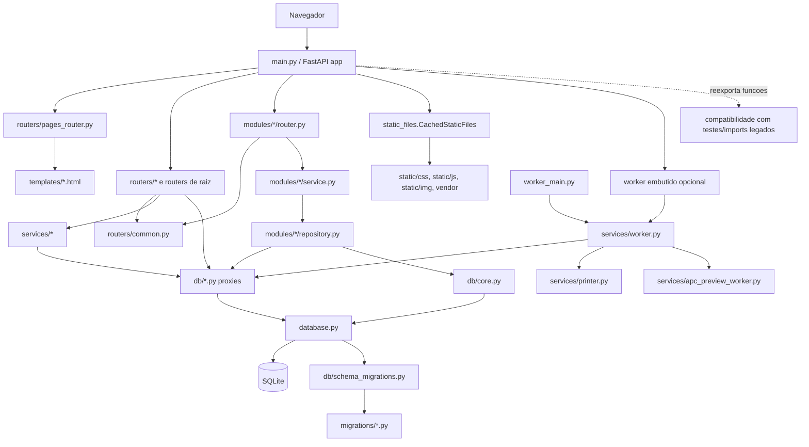

# Arquitetura: Estado atual

Este documento descreve como o sistema esta organizado hoje, com base no codigo existente. Ele nao descreve a arquitetura ideal, e sim o estado real observado no repositorio.

## Resumo

O projeto esta em uma arquitetura hibrida: parte do codigo ja foi movida para modulos por dominio em `modules/`, enquanto partes importantes ainda permanecem em arquivos legados globais, especialmente `main.py`, `database.py`, `models.py`, `auth.py` e alguns routers na raiz ou em `routers/`.

Classificacao: **Confirmada pelo codigo** em `main.py`, `database.py`, `models.py`, `modules/`, `routers/`, `services/` e `db/`.

## Organizacao das pastas

| Pasta/arquivo | Papel atual | Evidencia | Classificacao |
| --- | --- | --- | --- |
| `main.py` | Inicializa a aplicacao FastAPI, registra routers, monta arquivos estaticos, cria dados iniciais e inicia o worker embutido quando configurado. Tambem reexporta funcoes para compatibilidade. | `main.py`, funcoes `lifespan`, `_reload_or_import` e bloco de `app.include_router(...)`. | Confirmada pelo codigo |
| `auth.py` | Router e logica de autenticacao ainda em arquivo de raiz. | `main.py` importa `auth_router`, `login`, `logout`, `eu`, `internal_radius_ensure_nt_hash`. | Confirmada pelo codigo |
| `database.py` | Nucleo legado de banco: cria tabelas, aplica compatibilidades, seeds, migracoes e varias funcoes de persistencia. | `database.py`, funcoes `criar_tabelas`, `_aplicar_compatibilidade_schema_legada`, `_aplicar_seeds_iniciais`. | Confirmada pelo codigo |
| `models.py` | Schemas Pydantic globais usados por varios fluxos, incluindo impressao, autenticacao, agendamento, PCPI e pre-conselho. | `models.py`, classes `JobCreate`, `LoginIn`, `AgendamentoIn`, `PCPIRegistroManualIn`, `PreConselhoRegistroIn`. | Confirmada pelo codigo |
| `modules/` | Area modular moderna por dominio. Contem routers, services, repositories, schemas e models em alguns dominios. | `modules/printing`, `modules/scheduling`, `modules/audit`, `modules/occurrences`, `modules/preconselho`, `modules/apc_review`. | Confirmada pelo codigo |
| `routers/` | Routers legados, routers de pagina e routers de compatibilidade ainda usados pela aplicacao. | `main.py` registra `routers.pages_router`, `routers.impressao_router`, `routers.admin_router`, `routers.apc_router`, `routers.horario_escolar_router`, entre outros. | Confirmada pelo codigo |
| `services/` | Servicos de dominio, integracoes e operacao. Inclui worker, impressao, cotas, arquivos, PDF, APC, horario escolar, pre-conselho e YouTube. | Imports em `main.py`, `services/worker.py`, `services/horario_escolar_service.py`. | Confirmada pelo codigo |
| `db/` | Fachadas/proxies para `database.py`, alem de utilitarios de migracao e conexao. | `db/_proxy.py`, `db/core.py`, `db/bootstrap.py`, `db/impressao.py`, `db/agendamento.py`, `db/usuarios.py`. | Confirmada pelo codigo |
| `migrations/` | Migracoes versionadas em Python aplicadas por `db/schema_migrations.py`. | `db/schema_migrations.py`, funcoes `apply_pending_migrations`, `upgrade_database`. | Confirmada pelo codigo |
| `templates/` | Templates Jinja2 usados por routers de paginas e alguns fluxos. | `main.py` passa `templates` a routers; `routers/pages_router.py` renderiza paginas. | Confirmada pelo codigo |
| `static/` | CSS, JavaScript, imagens, vendor assets e recursos servidos por FastAPI. | `main.py` monta `/static`; `static_files.py` define `CachedStaticFiles`. | Confirmada pelo codigo |
| `deploy/` | Arquivos de apoio para operacao/deploy. | Presenca da pasta no repositorio. | Confirmada pelo codigo |
| `tests/` | Testes automatizados de partes especificas do sistema. | Arquivos em `tests/`, como testes de impressao, APC, pre-conselho, ocorrencias e CSV. | Confirmada pelo codigo |

## Diagrama da arquitetura atual

## Inicializacao da aplicacao

`main.py` e o ponto de entrada principal. Ele cria a aplicacao FastAPI, configura o ciclo de vida, registra routers, monta arquivos estaticos e expoe algumas funcoes de endpoints importadas de outros modulos.

Durante o `lifespan`, o sistema:

- registra metadados em `app.state`;
- chama `criar_tabelas()`;
- cria usuarios iniciais quando ausentes;
- executa `seed_recursos_padrao()`;
- decide se o worker de impressao roda embutido ou em processo externo.

Evidencia: `main.py`, funcao `lifespan`.

Classificacao: **Confirmada pelo codigo**.

## Modulos modernos

| Modulo | Organizacao atual | Observacoes | Classificacao |
| --- | --- | --- | --- |
| `modules/printing` | Possui router, service, repository, schemas, models e arquivos auxiliares. | E o modulo moderno mais estruturado, mas ainda convive com `routers/impressao_router.py` como camada de compatibilidade. | Confirmada pelo codigo |
| `modules/scheduling` | Possui router, service, repository, schemas, models, policies e configuracoes de aula. | Ja segue parte do fluxo modular, mas algumas politicas acessam repository diretamente e outros servicos dependem de configuracoes do modulo. | Confirmada pelo codigo |
| `modules/audit` | Possui router, repository, schemas e models. | Usa enums de dominio e integra com permissao/admin via `routers.common`. | Confirmada pelo codigo |
| `modules/occurrences` | Possui service/repository/router e integra com horario escolar e regras de ocorrencias. | Ha acoplamento com `routers.common` e `db.horario_escolar`. | Confirmada pelo codigo |
| `modules/preconselho` | Possui estrutura modular, mas tambem existe `preconselho_router.py` legado. | Indica transicao parcial entre arquitetura antiga e nova. | Confirmada pelo codigo |
| `modules/apc_review` | Possui repository/modelos ligados ao fluxo de revisao APC. | Atua junto a routers e services APC ainda espalhados. | Confirmada pelo codigo |

## Partes legadas e hibridas

Algumas areas ainda concentram responsabilidades fora da arquitetura modular alvo:

- `database.py` concentra schema, migracoes de compatibilidade, seeds e muitas funcoes de persistencia.
- `models.py` concentra schemas Pydantic globais de varios dominios.
- `main.py` reexporta funcoes importadas de routers e modulos.
- `auth.py`, `ocorrencias_router.py`, `pcpi_router.py` e varios arquivos em `routers/` ainda possuem papel central.
- `routers/impressao_router.py` funciona como router de compatibilidade para o modulo moderno de impressao.

Evidencia: `main.py`, `database.py`, `models.py`, `auth.py`, `routers/impressao_router.py`, `ocorrencias_router.py`, `pcpi_router.py`.

Classificacao: **Confirmada pelo codigo**.

## Dependencias entre routers, services, repositories e db

O fluxo alvo descrito em `ARCHITECTURE.md` e `router -> service -> repository -> database`. No codigo atual, esse fluxo existe em alguns modulos, mas ainda ha caminhos mistos:

| Fluxo observado | Exemplo | Classificacao |
| --- | --- | --- |
| `modules/*/router.py -> modules/*/service.py -> modules/*/repository.py` | Modulos modernos como `printing` e `scheduling`. | Confirmada pelo codigo |
| `router -> services/* -> db/*.py -> database.py` | Fluxos legados e operacionais, incluindo worker e servicos auxiliares. | Confirmada pelo codigo |
| `router -> db/*.py -> database.py` | Alguns routers acessam fachadas de banco diretamente. | Confirmada pelo codigo |
| `modules/* -> routers.common` | Permissoes e dependencias FastAPI compartilhadas importadas por modulos. | Confirmada pelo codigo |
| `services/* -> modules/scheduling/*` | Servicos como horario escolar reutilizam configuracoes do modulo de agendamento. | Confirmada pelo codigo |

Ponto de atencao: a dependencia de modulos de dominio em `routers.common` cria acoplamento com a camada HTTP/FastAPI.

Classificacao: **Inferida**, a partir dos imports observados.

## Funcoes reexportadas e compatibilidade

`main.py` importa e reexpoe varias funcoes de routers e modulos. Isso inclui endpoints de autenticacao, paginas, impressao, professor/publico e administracao.

Esse mecanismo parece existir para preservar compatibilidade com testes, imports legados ou referencias externas que ainda esperam encontrar funcoes no `main.py`.

Evidencia: `main.py`, blocos de imports de `auth`, `routers.pages_router`, `routers.impressao_router`, `routers.professores_router` e `routers.admin_router`.

Classificacao: **Inferida** quanto ao motivo; **Confirmada pelo codigo** quanto aos reexports.

## Acoplamentos com FastAPI

Os acoplamentos principais com FastAPI estao em:

- `main.py`, ao criar `FastAPI`, configurar `lifespan`, registrar routers e montar `/static`;
- routers em `routers/`, `auth.py`, `ocorrencias_router.py`, `pcpi_router.py` e `modules/*/router.py`;
- dependencias compartilhadas em `routers.common`;
- renderizacao de templates via `Jinja2Templates`;
- uso de `Request`, `Response`, `Depends`, `HTTPException`, redirects e responses.

Ponto de atencao: alguns modulos modernos importam dependencias de `routers.common`, o que mistura dominio modular com infraestrutura HTTP.

Classificacao: **Confirmada pelo codigo** para os imports; **Inferida** para o risco arquitetural.

## Dicionarios, schemas e entidades

O projeto usa tres estilos de dados em paralelo:

| Estilo | Onde aparece | Observacao | Classificacao |
| --- | --- | --- | --- |
| Dicionarios | Funcoes de banco, repositories e services retornando registros SQLite convertidos. | Ainda e o estilo dominante nos fluxos legados e em parte dos modulos. | Confirmada pelo codigo |
| Schemas Pydantic globais | `models.py`. | Mistura contratos de varios dominios em um arquivo central. | Confirmada pelo codigo |
| Schemas/modelos modulares | `modules/*/schemas.py` e `modules/*/models.py`. | Ja existem em modulos modernos, com dataclasses e enums em alguns casos. | Confirmada pelo codigo |

Exemplos confirmados:

- `models.py`: `JobCreate`, `LoginIn`, `UsuarioOut`, `AgendamentoIn`, schemas PCPI e pre-conselho.
- `modules/scheduling/models.py`: entidades de agendamento em dataclasses.
- `modules/printing/models.py`: modelos de resumo de job e cota.
- `modules/audit/models.py`: enums de categoria e resultado de auditoria.

## Integracao com banco de dados

O banco e SQLite. A integracao real passa principalmente por `database.py`, com fachadas em `db/`.

Componentes observados:

- `db/core.py`: expoe caminho/conexao principal.
- `db/bootstrap.py`: reexporta criacao de tabelas, seeds e usuarios iniciais.
- `db/_proxy.py`: carrega `database.py` dinamicamente e cria wrappers.
- `db/impressao.py`, `db/agendamento.py`, `db/usuarios.py` e outros arquivos `db/*.py`: funcionam como fachadas por dominio para funcoes ainda implementadas em `database.py`.
- `db/schema_migrations.py`: controla migracoes versionadas e chama `database.criar_tabelas()` no fluxo de upgrade.

Evidencia: `db/_proxy.py`, `db/core.py`, `db/bootstrap.py`, `db/schema_migrations.py`, `database.py`.

Classificacao: **Confirmada pelo codigo**.

## Mecanismos de compatibilidade do banco

`database.py` contem uma camada forte de compatibilidade de schema. A funcao `criar_tabelas()` nao apenas cria tabelas; ela tambem aplica migracoes versionadas, garante colunas, cria indices, executa seeds e adapta estruturas legadas.

Exemplos de funcoes de compatibilidade:

- `_aplicar_compatibilidade_schema_legada`;
- `_garantir_colunas_usuarios`;
- `_garantir_colunas_jobs`;
- `_garantir_colunas_agendamentos`;
- `_garantir_colunas_ocorrencias`;
- `_garantir_tabelas_ocorrencia_vinculados`;
- `_migrar_catalogos_academicos`;
- `_migrar_turmas_disciplinas_legado`;
- `_migrar_registros_pre_conselho_legado`;
- `_garantir_view_radcheck`.

Evidencia: `database.py`, funcoes acima.

Classificacao: **Confirmada pelo codigo**.

## Worker

O worker pode rodar de duas formas:

- embutido no processo da aplicacao, iniciado pelo `lifespan` de `main.py`;
- externo, iniciado por `worker_main.py`.

`services/worker.py` processa jobs de impressao e, quando nao ha impressao pendente, pode processar jobs de preview APC. Ele atualiza status, registra logs, interage com `services.printer` e usa funcoes de `db.impressao`.

Evidencia: `main.py`, `worker_main.py`, `services/worker.py`.

Classificacao: **Confirmada pelo codigo**.

## Arquivos estaticos

Arquivos estaticos ficam em `static/` e sao servidos em `/static`. A classe `CachedStaticFiles` customiza cabecalhos de cache por tipo de arquivo e caminho.

Regras observadas:

- recursos em `img/resources/` ou URLs com query string recebem cache longo e `immutable`;
- imagens recebem cache de um dia;
- demais arquivos recebem `no-cache, must-revalidate`.

Evidencia: `main.py`, montagem de `/static`; `static_files.py`, classe `CachedStaticFiles`.

Classificacao: **Confirmada pelo codigo**.

## Templates

Os templates Jinja2 ficam em `templates/`. Rotas de pagina usam `Jinja2Templates`, enquanto APIs retornam JSON, redirects ou responses especificas.

Ha acoplamento natural entre:

- routers de pagina;
- templates;
- arquivos `static/js`;
- arquivos `static/css`.

Esse acoplamento precisa ser considerado em refatoracoes, porque mudancas em rotas, nomes de campos ou endpoints podem quebrar JavaScript e telas.

Classificacao: **Confirmada pelo codigo** quanto ao uso; **Inferida** quanto ao risco.

## Possiveis dependencias circulares

Nao foi confirmada uma dependencia circular quebrando a execucao, mas ha pontos com risco arquitetural:

| Ponto | Motivo | Classificacao |
| --- | --- | --- |
| `db/_proxy.py -> database.py` com `database.py` importando outros servicos/db | O proxy dinamico reduz o erro imediato, mas esconde a dependencia real. | Inferida |
| `modules/* -> routers.common` | Modulos de dominio dependem de uma camada de router/HTTP para permissao e usuario atual. | Inferida |
| `services/horario_escolar_service.py -> modules/scheduling/*` | Servico compartilhado depende de configuracoes internas de outro modulo. | Inferida |
| `main.py` reexportando endpoints | Mantem compatibilidade, mas aumenta o acoplamento entre ponto de entrada, routers e testes. | Inferida |
| `database.py` concentrando schema, seeds, migracoes e persistencia | Dificulta isolamento de modulos e aumenta chance de importacoes cruzadas futuras. | Inferida |

## Mecanismos provisorios de compatibilidade

Foram identificados estes mecanismos:

- proxies em `db/*.py` apontando para funcoes em `database.py`;
- imports dinamicos em `db/_proxy.py`;
- reexports de endpoints em `main.py`;
- routers legados convivendo com routers modulares;
- criacao/alteracao incremental de schema dentro de `criar_tabelas()`;
- seeds automaticos no boot da aplicacao;
- router de impressao legado funcionando como ponte para `modules/printing`.

Classificacao: **Confirmada pelo codigo** para a existencia; **Inferida** para o carater provisorio.

## Pendencias de validacao

- Confirmar quais imports externos ou testes ainda dependem das funcoes reexportadas por `main.py`.
- Confirmar se o worker roda em producao embutido, externo ou ambos em ambientes diferentes.
- Confirmar quais routers legados ainda possuem uso direto por usuarios finais.
- Confirmar se todas as funcoes de compatibilidade de schema ainda sao necessarias para bancos reais em producao.
- Confirmar se dependencias de `modules/*` em `routers.common` serao mantidas ou movidas futuramente para camada compartilhada.
- Confirmar se `models.py` deve continuar como contrato global ou ser gradualmente dividido por modulo.

Classificacao: **Pendente de validacao**.
