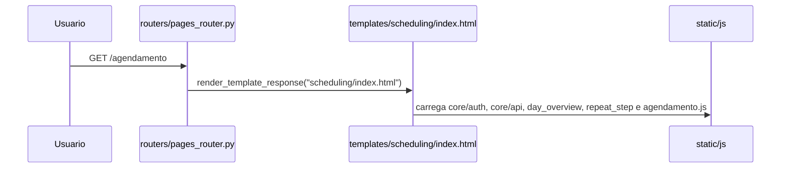
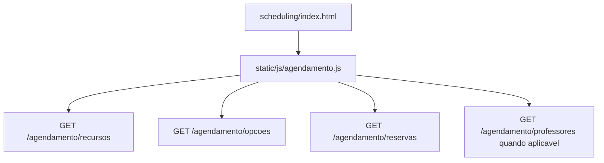
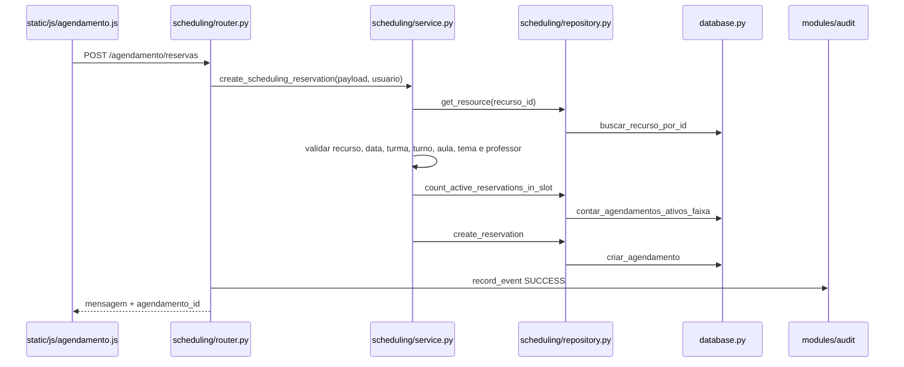
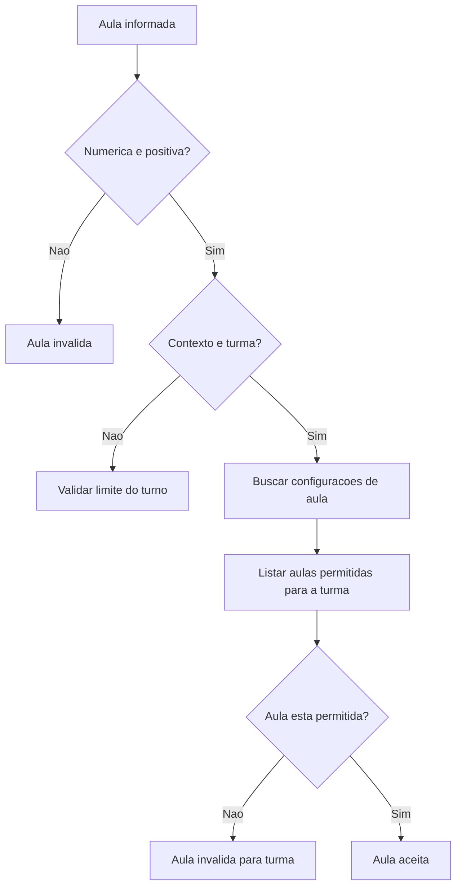
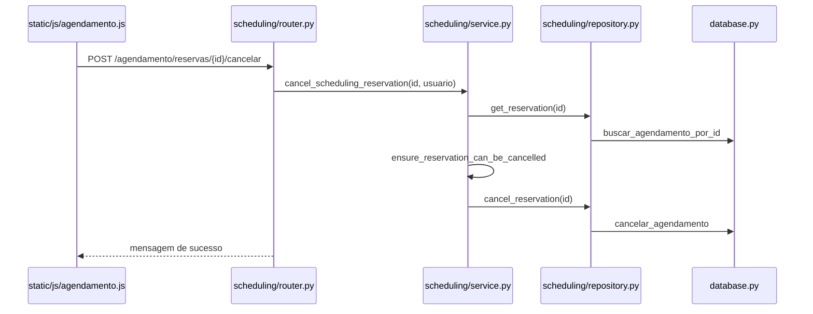
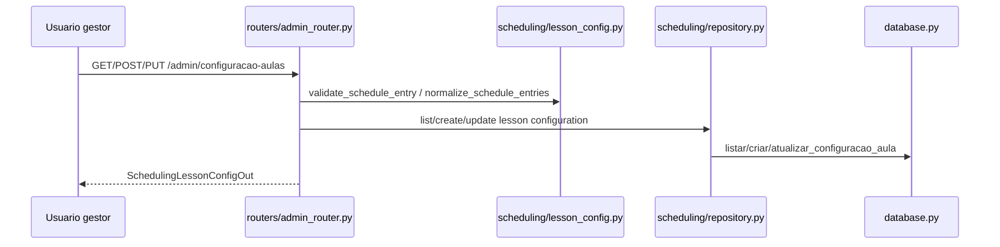
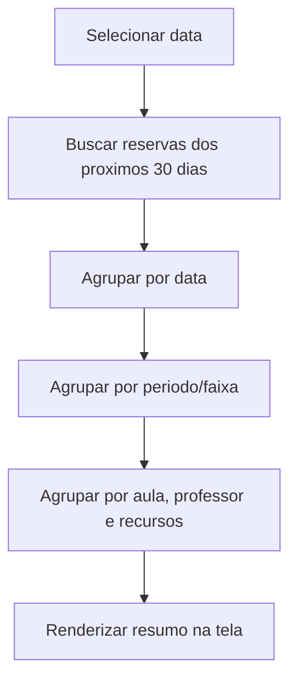
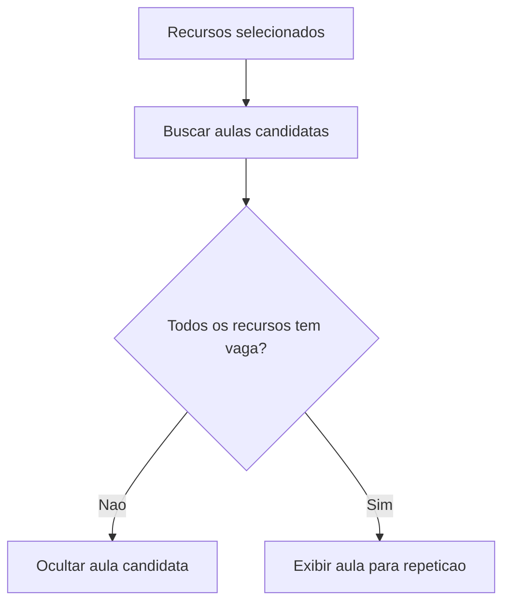
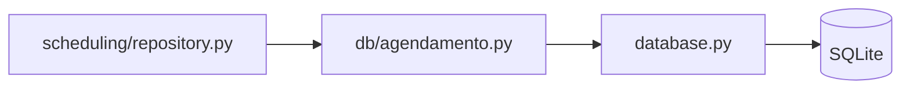

# Fluxos: Agendamento

## Objetivo

Este documento descreve os principais fluxos do modulo de agendamento no estado atual do codigo.

## Fluxo De Acesso A Tela

Passos:

1. O usuario acessa `/agendamento`.
2. `routers/pages_router.py` renderiza `templates/scheduling/index.html`.
3. O template carrega scripts compartilhados e scripts especificos do agendamento.

Base:

- `routers/pages_router.py`: `agendamento_page`
- `templates/scheduling/index.html`
- `static/js/agendamento.js`
- `static/js/scheduling/day_overview.js`
- `static/js/scheduling/repeat_step.js`

Classificacao: Confirmada pelo codigo.

## Fluxo De Carregamento Inicial

Chamadas principais do frontend:

- `GET /agendamento/recursos`
- `GET /agendamento/opcoes`
- `GET /agendamento/reservas`
- `GET /agendamento/professores`

Base:

- `static/js/agendamento.js`: `carregarRecursos`
- `static/js/agendamento.js`: `carregarOpcoesAgendamento`
- `static/js/agendamento.js`: `carregarReservasMes`
- `static/js/agendamento.js`: chamada para `/agendamento/professores`
- `modules/scheduling/router.py`: `recursos_agendamento`, `opcoes_agendamento`, `listar_reservas_agendamento`, `professores_agendamento`

Classificacao: Confirmada pelo codigo.

## Fluxo De Criacao De Reserva

Em caso de `HTTPException`, o router registra auditoria de falha e relanca a excecao.

Base:

- `static/js/agendamento.js`: chamada `fetchComAuth("/agendamento/reservas")`
- `modules/scheduling/router.py`: `criar_reserva_agendamento`
- `modules/scheduling/service.py`: `create_scheduling_reservation`
- `modules/scheduling/service.py`: `build_reservation_creation_payload`
- `modules/scheduling/service.py`: `ensure_slot_has_capacity`
- `modules/scheduling/repository.py`: `get_resource`, `count_active_reservations_in_slot`, `create_reservation`
- `database.py`: `buscar_recurso_por_id`, `contar_agendamentos_ativos_faixa`, `criar_agendamento`

Classificacao: Confirmada pelo codigo.

## Fluxo De Validacao Da Aula

Base:

- `modules/scheduling/policies.py`: `validar_aula`
- `modules/scheduling/lesson_config.py`: `list_lessons_for_class`
- `modules/scheduling/lesson_config.py`: `resolve_class_lesson_window`
- `modules/scheduling/lesson_config.py`: `lesson_number_is_allowed_for_turn`

Classificacao: Confirmada pelo codigo.

## Fluxo De Cancelamento

Validacoes do cancelamento:

- reserva precisa existir;
- status precisa ser `ATIVO`;
- data precisa ser valida;
- data nao pode ser passada;
- usuario precisa ser dono ou admin.

Base:

- `static/js/agendamento.js`: `cancelarReserva` e chamadas para `/agendamento/reservas/{id}/cancelar`
- `modules/scheduling/router.py`: `cancelar_reserva_agendamento`
- `modules/scheduling/service.py`: `cancel_scheduling_reservation`
- `modules/scheduling/service.py`: `ensure_reservation_can_be_cancelled`
- `modules/scheduling/repository.py`: `get_reservation`, `cancel_reservation`
- `database.py`: `buscar_agendamento_por_id`, `cancelar_agendamento`

Classificacao: Confirmada pelo codigo.

## Fluxo De Configuracao Global De Aulas

Essa configuracao e consumida pelo endpoint `/agendamento/opcoes` e pelas validacoes de aula.

Base:

- `routers/admin_router.py`: `listar_configuracao_aulas_admin`
- `routers/admin_router.py`: `criar_configuracao_aulas_admin`
- `routers/admin_router.py`: `atualizar_configuracao_aulas_admin`
- `modules/scheduling/lesson_config.py`: `validate_schedule_entry`, `normalize_schedule_entries`
- `modules/scheduling/repository.py`: `list_lesson_configurations`, `create_lesson_configuration`, `update_lesson_configuration`
- `database.py`: `listar_configuracoes_aulas`, `criar_configuracao_aula`, `atualizar_configuracao_aula`

Classificacao: Confirmada pelo codigo.

## Fluxo De Visao Dos Proximos Agendamentos

Base:

- `static/js/scheduling/day_overview.js`: `carregarReservasProximosDias`
- `static/js/scheduling/day_overview.js`: `agruparReservasPorDataProxima`
- `static/js/scheduling/day_overview.js`: `agruparReservasPorPeriodoVisao`
- `static/js/scheduling/day_overview.js`: `agruparReservasVisaoDia`
- `tests/test_scheduling_day_overview.py`: `test_renderer_agrupa_por_aula_professor_e_recursos`

Classificacao: Confirmada pelo codigo.

## Fluxo De Repeticao De Agendamento

Base:

- `templates/scheduling/index.html`: include de `includes/scheduling_repeat_step.html`
- `templates/includes/scheduling_repeat_step.html`
- `static/js/scheduling/repeat_step.js`
- `static/js/agendamento.js`: `obterRecursosSelecionadosAgendamento`
- `static/js/agendamento.js`: `aulaSuportaRecursosSelecionados`
- `tests/test_scheduling_repeat_step.py`: `test_template_declara_quinta_etapa_e_assets`
- `tests/test_scheduling_repeat_step.py`: `test_controlador_filtra_por_disponibilidade_dos_recursos`

Classificacao: Confirmada pelo codigo.

## Fluxo De Persistencia

No estado atual, os arquivos em `db/` atuam como fachadas/proxies para funcoes implementadas em `database.py`.

Base:

- `modules/scheduling/repository.py`
- `db/agendamento.py`
- `db/catalogos.py`
- `db/horario_escolar.py`
- `db/usuarios.py`
- `database.py`

Classificacao: Confirmada pelo codigo.

## Testes Relacionados Aos Fluxos

| Fluxo | Testes | Classificacao |
| --- | --- | --- |
| Carregamento de endpoints | `tests/test_scheduling_router.py`: `test_agendamento_get_endpoints_return_expected_payloads` | Confirmada pelo codigo |
| Criacao e cancelamento | `tests/test_scheduling_router.py`: `test_agendamento_create_and_cancel_reservation`; `tests/test_scheduling_service.py`: `test_create_scheduling_reservation_calls_repository_functions`, `test_cancel_scheduling_reservation_calls_repository_functions` | Confirmada pelo codigo |
| Regras de periodo e capacidade | `tests/test_scheduling_service.py`: `test_validate_scheduling_period_rejects_invalid_range`, `test_ensure_slot_has_capacity_rejects_full_slot` | Confirmada pelo codigo |
| Grade global e turno integral | `tests/test_scheduling_service.py`: `test_integral_skips_global_slot_six_and_starts_afternoon_at_seven` | Confirmada pelo codigo |
| Visao dos proximos dias | `tests/test_scheduling_day_overview.py` | Confirmada pelo codigo |
| Etapa de repeticao | `tests/test_scheduling_repeat_step.py` | Confirmada pelo codigo |
| Migrations de grade/faixa | `tests/test_schedule_repair_migration.py`; `tests/test_schema_migrations.py` | Confirmada pelo codigo |
