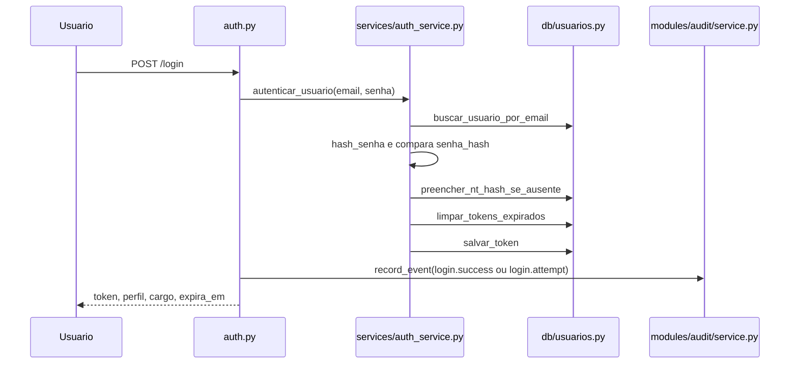
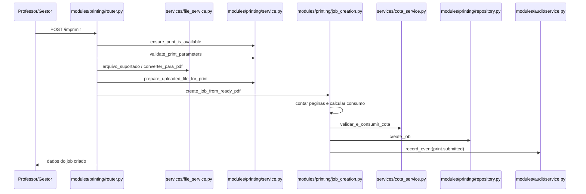
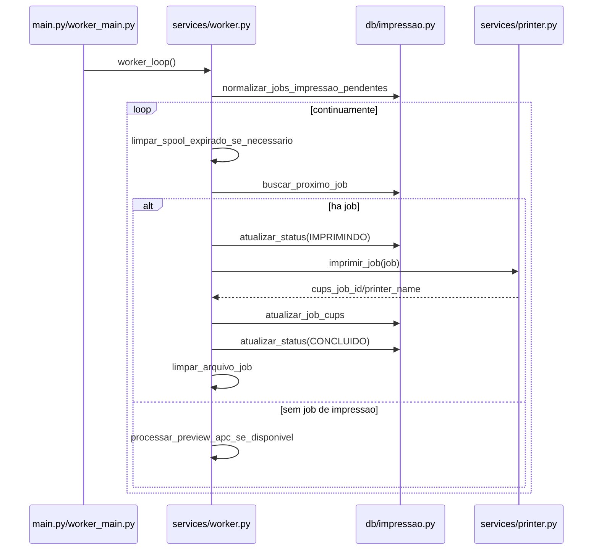
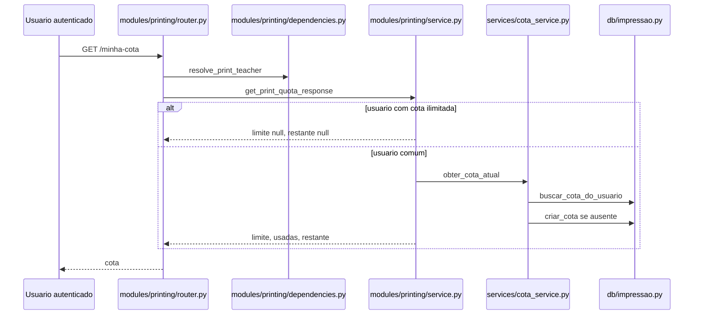
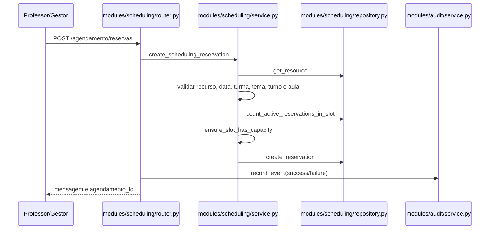
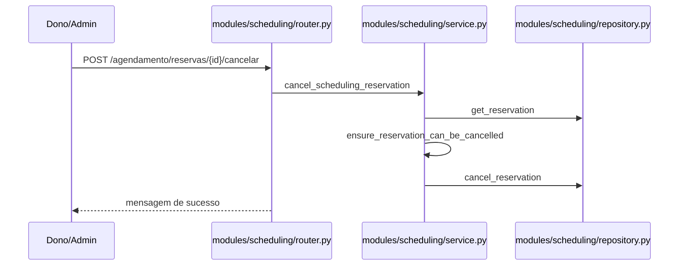
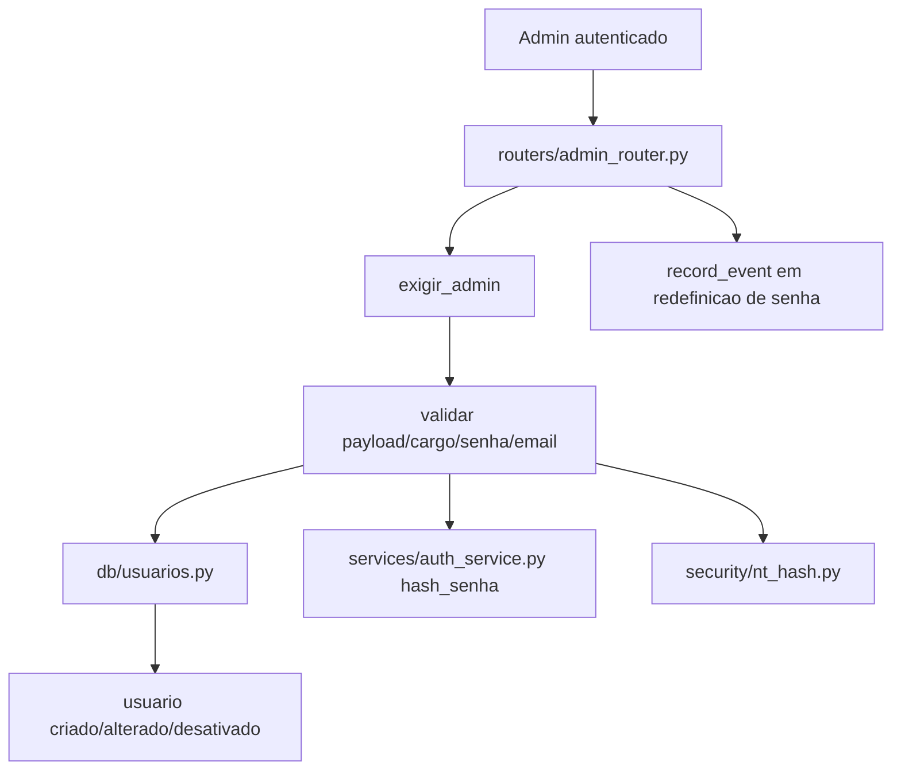
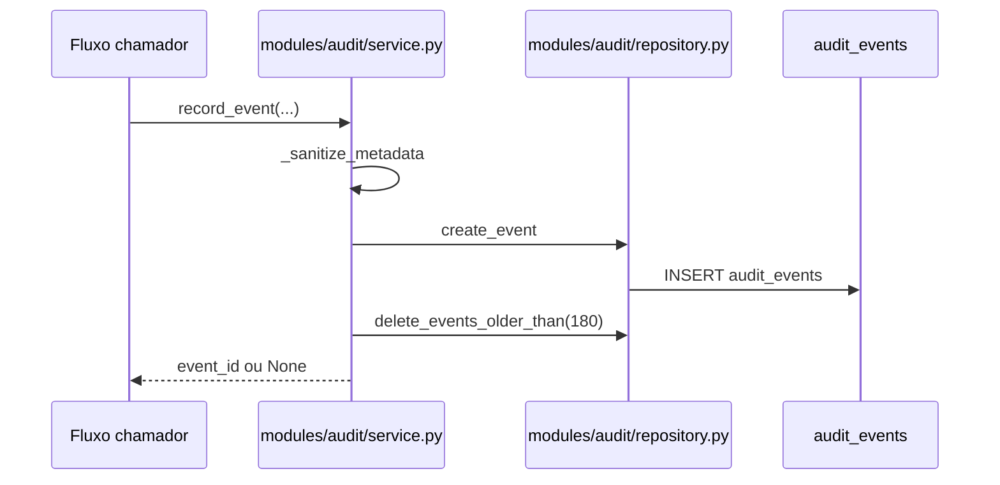

# Fluxos principais do sistema

Este documento consolida os fluxos principais observados no codigo atual. Fluxos ja detalhados em arquivos especificos, como `docs/06-fluxos/agendamento.md`, tambem aparecem aqui em formato resumido para facilitar consulta.

## Login

| Campo | Descricao |
| --- | --- |
| Ator | Usuario nao autenticado. |
| Ponto de entrada | `POST /login`, `auth.py`: `login`. |
| Validacoes | Normaliza email; busca usuario; compara `hash_senha(senha)` com `senha_hash`; rejeita credenciais invalidas. |
| Regras aplicadas | Gera token UUID com TTL; limpa tokens expirados; preenche NT hash ausente; registra auditoria de sucesso ou falha. |
| Acesso a dados | `services/auth_service.py`: `autenticar_usuario`; `db/usuarios.py`: `buscar_usuario_por_email`, `salvar_token`, `buscar_usuario_por_token`, `limpar_tokens_expirados`, `preencher_nt_hash_se_ausente`. |
| Resultado | Retorna `token`, `perfil`, `cargo`, `expira_em` e `token_ttl_dias`. |
| Erros possiveis | `401 Credenciais invalidas`; falhas internas de banco/token nao tratadas localmente. |
| Arquivos envolvidos | `auth.py`, `services/auth_service.py`, `db/usuarios.py`, `modules/audit/service.py`, `modules/audit/repository.py`, `models.py`. |

Classificacao: **Confirmada pelo codigo**.

## Criacao de solicitacao de impressao

| Campo | Descricao |
| --- | --- |
| Ator | Professor; coordenador/admin quando permitido para selecionar professor responsavel. |
| Ponto de entrada | `POST /imprimir`, `modules/printing/router.py`: `imprimir`. |
| Validacoes | Usuario autenticado; impressao disponivel; parametros de impressao validos; arquivo enviado; formato suportado; arquivo nao vazio; conversao para PDF; intervalo de paginas valido; tags obrigatorias. |
| Regras aplicadas | Resolve professor responsavel; calcula paginas consumidas por copias, paginas por folha e duplex; valida/consome cota quando usuario nao tem cota ilimitada; cria job de impressao; registra auditoria. |
| Acesso a dados | `modules/printing/repository.py`: `create_job`; `services/cota_service.py`: `validar_e_consumir_cota`; `db/impressao.py` via repository/cota. |
| Resultado | Retorna mensagem, paginas do documento, paginas selecionadas, copias, paginas consumidas, paginas restantes, cota ilimitada e tags. |
| Erros possiveis | `400` arquivo ausente/vazio/formato invalido/intervalo invalido; `403` cota insuficiente; `500` falha ao armazenar, converter, ler PDF ou registrar job. |
| Arquivos envolvidos | `modules/printing/router.py`, `modules/printing/service.py`, `modules/printing/job_creation.py`, `modules/printing/policies.py`, `modules/printing/repository.py`, `services/file_service.py`, `services/pdf_service.py`, `services/cota_service.py`, `modules/audit/service.py`. |

Classificacao: **Confirmada pelo codigo**.

## Processamento da fila de impressao

| Campo | Descricao |
| --- | --- |
| Ator | Worker do sistema, embutido no processo FastAPI ou externo via `worker_main.py`. |
| Ponto de entrada | `services/worker.py`: `worker_loop`; iniciado por `main.py`: `lifespan` ou por `worker_main.py`. |
| Validacoes | Normaliza jobs pendentes no inicio; respeita janela de cancelamento; protege arquivos de jobs em andamento na limpeza do spool. |
| Regras aplicadas | Processa um job por vez; marca `IMPRIMINDO`, envia ao printer, registra CUPS, marca `CONCLUIDO`; em erro marca `ERRO`; quando nao ha impressao, tenta processar preview APC. |
| Acesso a dados | `db/impressao.py`: `buscar_proximo_job`, `normalizar_jobs_impressao_pendentes`, `atualizar_status`, `atualizar_job_cups`, `atualizar_erro_job`, `listar_arquivo_paths_jobs_em_andamento`. |
| Resultado | Job impresso e atualizado no banco; arquivo spool removido quando configurado; worker permanece em loop. |
| Erros possiveis | Falha no printer, CUPS ou arquivo gera log, `atualizar_erro_job` e status `ERRO`; falhas de preview APC sao registradas sem parar o loop. |
| Arquivos envolvidos | `main.py`, `worker_main.py`, `services/worker.py`, `services/printer.py`, `services/apc_preview_worker.py`, `db/impressao.py`. |

Classificacao: **Confirmada pelo codigo**.

## Consulta de cota

| Campo | Descricao |
| --- | --- |
| Ator | Professor autenticado; gestor/admin consultando outro professor quando permitido. |
| Ponto de entrada | `GET /minha-cota`, `modules/printing/router.py`: `minha_cota`. |
| Validacoes | Token valido; resolve usuario/professor de consulta; aplica regra de permissao em `resolve_print_teacher`. |
| Regras aplicadas | Usuarios com cota ilimitada recebem limite/restante `null`; usuarios comuns consultam ou criam cota do mes atual. |
| Acesso a dados | `services/cota_service.py`: `obter_cota_atual`; `db/impressao.py`: `buscar_cota_do_usuario`, `criar_cota`, `calcular_limite_cota_usuario`. |
| Resultado | Retorna `limite`, `usadas`, `restante` e `ilimitada` quando aplicavel. |
| Erros possiveis | `401` token invalido; `403` quando usuario tenta consultar professor sem permissao; falhas internas na criacao/consulta de cota. |
| Arquivos envolvidos | `modules/printing/router.py`, `modules/printing/dependencies.py`, `modules/printing/service.py`, `services/cota_service.py`, `db/impressao.py`, `routers/common.py`. |

Classificacao: **Confirmada pelo codigo**.

## Criacao de agendamento

| Campo | Descricao |
| --- | --- |
| Ator | Professor autenticado; gestor/admin quando seleciona professor responsavel. |
| Ponto de entrada | `POST /agendamento/reservas`, `modules/scheduling/router.py`: `criar_reserva_agendamento`. |
| Validacoes | Token valido; recurso ativo; data valida; turma valida; tema valido; turno configurado; aula valida; professor selecionado permitido. |
| Regras aplicadas | Calcula faixa/aula global; exige janela de aulas configurada quando ha grade; verifica capacidade do recurso na faixa; registra auditoria de sucesso ou falha. |
| Acesso a dados | `modules/scheduling/repository.py`: `get_resource`, `count_active_reservations_in_slot`, `create_reservation`; `db/agendamento.py` e `database.py` via repository. |
| Resultado | Cria reserva ativa e retorna mensagem com `agendamento_id`. |
| Erros possiveis | `400` dados invalidos/configuracao ausente; `404` recurso nao encontrado; `409` capacidade maxima atingida; `403` professor selecionado sem permissao. |
| Arquivos envolvidos | `modules/scheduling/router.py`, `modules/scheduling/service.py`, `modules/scheduling/repository.py`, `modules/scheduling/dependencies.py`, `modules/scheduling/lesson_config.py`, `db/agendamento.py`, `modules/audit/service.py`. |

Classificacao: **Confirmada pelo codigo**.

## Cancelamento de agendamento

| Campo | Descricao |
| --- | --- |
| Ator | Dono da reserva ou admin. |
| Ponto de entrada | `POST /agendamento/reservas/{agendamento_id}/cancelar`, `modules/scheduling/router.py`: `cancelar_reserva_agendamento`. |
| Validacoes | Token valido; agendamento existe; status e `ATIVO`; data do agendamento valida; data nao esta no passado; usuario e dono ou admin. |
| Regras aplicadas | Apenas agendamentos ativos e futuros podem ser cancelados pelo dono ou admin. |
| Acesso a dados | `modules/scheduling/repository.py`: `get_reservation`, `cancel_reservation`; `db/agendamento.py`: `buscar_agendamento_por_id`, `cancelar_agendamento`. |
| Resultado | Marca/cancela agendamento e retorna mensagem de sucesso. |
| Erros possiveis | `404` agendamento nao encontrado; `400` ja cancelado ou data invalida; `409` data passada; `403` usuario sem permissao; `400` falha ao cancelar. |
| Arquivos envolvidos | `modules/scheduling/router.py`, `modules/scheduling/service.py`, `modules/scheduling/repository.py`, `modules/scheduling/dependencies.py`, `db/agendamento.py`. |

Classificacao: **Confirmada pelo codigo**.

## Administracao de usuarios

| Campo | Descricao |
| --- | --- |
| Ator | Administrador autenticado. |
| Ponto de entrada | `routers/admin_router.py`: `listar_professores_painel`, `listar_coordenadores_painel`, `criar_coordenador_painel`, `criar_professor_painel`, `atualizar_professor_painel`, `redefinir_senha_professor_painel`, `excluir_professor_painel`, `promover_professor_para_coordenador_painel`, `atualizar_carga_professor_painel`. |
| Validacoes | `exigir_admin`; payloads de cadastro/atualizacao; email unico por tratamento de `sqlite3.IntegrityError`; professor existente e com perfil correto; senha forte em redefinicao; numeros nao negativos para carga. |
| Regras aplicadas | Cria professor/coordenador com `senha_hash` e `nt_hash`; atualiza dados de professor; redefine senha e revoga tokens; exclusao e logica por desativacao; promocao de professor para coordenador; atualizacao de carga docente. |
| Acesso a dados | `db/usuarios.py`: `listar_professores_admin`, `listar_coordenadores_admin`, `criar_professor`, `criar_coordenador`, `buscar_usuario_por_id`, `atualizar_professor`, `atualizar_senha_usuario`, `desativar_professor`, `promover_professor_para_coordenador`, `revogar_tokens_usuario`; `db/docencia.py`: `salvar_carga_professor`. |
| Resultado | Lista, cria, altera, redefine senha, desativa, promove ou atualiza carga de usuarios. |
| Erros possiveis | `401` token invalido; `403` sem perfil admin; `400` payload invalido/senha ausente/senha fraca/professor ja excluido; `404` professor nao encontrado; `409` email duplicado. |
| Arquivos envolvidos | `routers/admin_router.py`, `routers/common.py`, `routers/professores_common.py`, `db/usuarios.py`, `db/docencia.py`, `services/auth_service.py`, `security/nt_hash.py`, `modules/audit/service.py`. |

Classificacao: **Confirmada pelo codigo**.

## Registro de auditoria

| Campo | Descricao |
| --- | --- |
| Ator | Fluxos internos do backend; admin ao consultar eventos. |
| Ponto de entrada | Interno: `modules/audit/service.py`: `record_event`; consulta: `GET /admin/audit/events`, `modules/audit/router.py`: `audit_events`. |
| Validacoes | Sanitiza textos; remove chaves sensiveis de metadata; limita profundidade/listas; na consulta valida datas, categoria, resultado, pagina e tamanho. |
| Regras aplicadas | Auditoria nao deve vazar senha/token; eventos antigos acima de 180 dias sao removidos apos registro; falha ao registrar auditoria nao derruba o fluxo chamador. |
| Acesso a dados | `modules/audit/repository.py`: `create_event`, `delete_events_older_than`, `list_events`; tabela `audit_events`. |
| Resultado | Evento de auditoria gravado ou consulta paginada de eventos. |
| Erros possiveis | `record_event` captura excecoes e retorna `None`; consulta pode retornar `400` para filtros invalidos; acesso a consulta depende de admin em `modules/audit/router.py`. |
| Arquivos envolvidos | `modules/audit/service.py`, `modules/audit/repository.py`, `modules/audit/router.py`, `modules/audit/models.py`, `modules/audit/schemas.py`, fluxos chamadores como `auth.py`, `modules/printing/job_creation.py`, `modules/scheduling/router.py`, `routers/admin_router.py`. |

Classificacao: **Confirmada pelo codigo**.

## Observacoes gerais

- Autenticacao e autorizacao entram por `auth.py`: `get_usuario_logado` e por helpers em `routers/common.py`.
- Muitos fluxos modernos ja usam `router -> service -> repository`, mas o acesso final a dados ainda passa por proxies em `db/` e funcoes em `database.py`.
- Os fluxos de impressao e agendamento ja registram auditoria em pontos criticos.
- A administracao de usuarios ainda esta concentrada em `routers/admin_router.py`, com acesso direto a funcoes de `db/usuarios.py`.

Classificacao: **Confirmada pelo codigo** para os caminhos observados; **Inferida** para a avaliacao arquitetural.
