# Relacionamentos De Dados

Status: mapa inicial baseado em FKs declaradas e relacoes claramente inferidas.

## Relacionamentos Confirmados Por FK

| Origem | Relacao | Destino | Tipo aparente | Evidencia |
| --- | --- | --- | --- | --- |
| `tokens.usuario_id` | pertence a | `usuarios.id` | N:1 logica, sem FK no CREATE atual | Confirmada pelo codigo: `database.py`: `tokens`. |
| `agendamentos.recurso_id` | reserva | `recursos.id` | N:1 | Confirmada pelo codigo: `database.py`: `agendamentos`. |
| `agendamentos.usuario_id` | pertence ao professor/usuario | `usuarios.id` | N:1 | Confirmada pelo codigo: `database.py`: `agendamentos`. |
| `professores_carga.usuario_id` | detalha carga de | `usuarios.id` | 1:1 | Confirmada pelo codigo: `database.py`: `professores_carga`. |
| `professores_turmas_disciplinas.professor_usuario_id` | vincula professor | `usuarios.id` | N:1 | Confirmada pelo codigo: `database.py`: `professores_turmas_disciplinas`. |
| `professores_turmas_disciplinas.turma_id` | vincula turma | `turmas.id` | N:1 | Confirmada pelo codigo: `database.py`: `professores_turmas_disciplinas`. |
| `professores_turmas_disciplinas.disciplina_id` | vincula disciplina | `disciplinas.id` | N:1 | Confirmada pelo codigo: `database.py`: `professores_turmas_disciplinas`. |
| `turmas_disciplinas.turma_id` | compoe grade | `turmas.id` | N:1 | Confirmada pelo codigo: `database.py`: `turmas_disciplinas`. |
| `turmas_disciplinas.disciplina_id` | compoe grade | `disciplinas.id` | N:1 | Confirmada pelo codigo: `database.py`: `turmas_disciplinas`. |
| `turmas_disciplinas.professor_usuario_id` | professor atribuido | `usuarios.id` | N:1 opcional | Confirmada pelo codigo: `database.py`: `turmas_disciplinas`. |
| `estudantes.turma_id` | pertence a | `turmas.id` | N:1 | Confirmada pelo codigo: `database.py`: `estudantes`. |
| `horarios_escolares.turma_id` | agenda turma | `turmas.id` | N:1 | Confirmada pelo codigo: migration `20260511_create_horario_escolar_module.py`. |
| `horarios_escolares.disciplina_id` | agenda disciplina | `disciplinas.id` | N:1 | Confirmada pelo codigo: migration `20260511_create_horario_escolar_module.py`. |
| `horarios_escolares.professor_usuario_id` | agenda professor | `usuarios.id` | N:1 | Confirmada pelo codigo: migration `20260511_create_horario_escolar_module.py`. |
| `pcpi_registros_manuais.agendamento_id` | pode nascer de | `agendamentos.id` | N:1 opcional | Confirmada pelo codigo: `database.py`: `pcpi_registros_manuais`. |
| `pcpi_registros_manuais.criado_por_usuario_id` | criado por | `usuarios.id` | N:1 opcional | Confirmada pelo codigo: `database.py`: `pcpi_registros_manuais`. |
| `pre_conselho_registros.periodo_id` | pertence a | `pre_conselho_periodos.id` | N:1 opcional | Confirmada pelo codigo: `database.py`: `pre_conselho_registros`. |
| `pre_conselho_registros.disciplina_id` | referencia | `disciplinas.id` | N:1 opcional | Confirmada pelo codigo: `database.py`: `pre_conselho_registros`. |
| `pre_conselho_registros.professor_usuario_id` | preenchido por | `usuarios.id` | N:1 | Confirmada pelo codigo: `database.py`: `pre_conselho_registros`. |
| `pre_conselho_registros.turma_id` | para turma | `turmas.id` | N:1 | Confirmada pelo codigo: `database.py`: `pre_conselho_registros`. |
| `pre_conselho_registros.estudante_id` | para estudante | `estudantes.id` | N:1 | Confirmada pelo codigo: `database.py`: `pre_conselho_registros`. |
| `pre_conselho_registro_motivos.registro_id` | classifica | `pre_conselho_registros.id` | N:1 com cascade | Confirmada pelo codigo: `database.py`: `pre_conselho_registro_motivos`. |
| `pre_conselho_registro_motivos.motivo_id` | usa | `pre_conselho_motivos.id` | N:1 | Confirmada pelo codigo: `database.py`: `pre_conselho_registro_motivos`. |
| `ocorrencias.estudante_id` | envolve | `estudantes.id` | N:1 opcional | Confirmada pelo codigo: `database.py`: `ocorrencias`. |
| `ocorrencias.turma_id` | ocorre em | `turmas.id` | N:1 opcional | Confirmada pelo codigo: `database.py`: `ocorrencias`. |
| `ocorrencias.professor_requerente_id` | requerida por | `usuarios.id` | N:1 opcional | Confirmada pelo codigo: `database.py`: `ocorrencias`. |
| `artigos.lei_id` | pertence a | `leis.id` | N:1 | Confirmada pelo codigo: `database.py`: `artigos`. |
| `incisos.artigo_id` | pertence a | `artigos.id` | N:1 | Confirmada pelo codigo: `database.py`: `incisos`. |
| `alineas.inciso_id` | pertence a | `incisos.id` | N:1 | Confirmada pelo codigo: `database.py`: `alineas`. |
| `ocorrencia_regimento_itens.ocorrencia_id` | anexa item legal a | `ocorrencias.id` | N:1 | Confirmada pelo codigo: `database.py`: `ocorrencia_regimento_itens`. |
| `apc_periodos.criado_por_usuario_id` | criado por | `usuarios.id` | N:1 | Confirmada pelo codigo: migration `20260511_create_apc_module.py`. |
| `apc_periodo_destinatarios.periodo_id` | seleciona destinatario para | `apc_periodos.id` | N:1 com cascade | Confirmada pelo codigo: migration `20260521_add_apc_destinatarios_selecionados.py`. |
| `apc_periodo_destinatarios.professor_usuario_id` | professor destinatario | `usuarios.id` | N:1 | Confirmada pelo codigo: migration `20260521_add_apc_destinatarios_selecionados.py`. |
| `apc_periodo_destinatarios.turma_id` | turma destinataria | `turmas.id` | N:1 | Confirmada pelo codigo: migration `20260521_add_apc_destinatarios_selecionados.py`. |
| `apc_periodo_destinatarios.disciplina_id` | disciplina destinataria | `disciplinas.id` | N:1 | Confirmada pelo codigo: migration `20260521_add_apc_destinatarios_selecionados.py`. |
| `apc_envios.periodo_id` | envio de periodo | `apc_periodos.id` | N:1 | Confirmada pelo codigo: migration `20260512_add_apc_envios_por_disciplina.py`. |
| `apc_envios.professor_usuario_id` | enviado por | `usuarios.id` | N:1 | Confirmada pelo codigo: migration `20260512_add_apc_envios_por_disciplina.py`. |
| `apc_envios.turma_id` | envio por turma | `turmas.id` | N:1 | Confirmada pelo codigo: migration `20260512_add_apc_envios_por_disciplina.py`. |
| `apc_envios.disciplina_id` | envio por disciplina | `disciplinas.id` | N:1 | Confirmada pelo codigo: migration `20260512_add_apc_envios_por_disciplina.py`. |
| `apc_envio_historico.envio_id` | historico de | `apc_envios.id` | N:1 com cascade | Confirmada pelo codigo: migration `20260622_add_apc_submission_history.py`. |
| `apc_preview_jobs.envio_id` | preview de | `apc_envios.id` | 1:1 | Confirmada pelo codigo: migration `20260622_create_apc_preview_jobs.py`. |
| `audit_events.actor_user_id` | ator | `usuarios.id` | N:1 opcional com SET NULL | Confirmada pelo codigo: migration `20260615_create_audit_events.py`. |

## Relacoes Logicas Ou Textuais

| Origem | Relacao | Destino | Classificacao |
| --- | --- | --- | --- |
| `jobs.usuario_id` | job pertence ao usuario/professor | `usuarios.id` | Inferida: campo e joins em `database.py`: `listar_historico`, mas sem FK declarada. |
| `cotas.usuario_id` | cota mensal pertence ao usuario | `usuarios.id` | Inferida: campo e indice unico por usuario/mes, mas sem FK declarada. |
| `agendamentos.turma` | guarda nome textual da turma | `turmas.nome` | Inferida: nao ha FK; service valida turma por nome antes de criar. |
| `pre_conselho_registros.disciplina` | snapshot textual da disciplina | `disciplinas.nome` | Inferida: tabela tambem possui `disciplina_id`. |
| `ocorrencias.nome_estudante` e snapshots de regimento | preservam texto historico | tabelas de catalogo/base legal | Inferida: coexistem FKs e campos textuais de snapshot. |

## Diagrama ER

O diagrama abaixo usa relacoes confirmadas por FK ou claramente inferidas pelo schema. Relacoes puramente textuais foram mantidas fora do diagrama.

```mermaid
erDiagram
    USUARIOS ||--o{ TOKENS : autentica
    USUARIOS ||--o{ JOBS : solicita
    USUARIOS ||--o{ COTAS : consome
    USUARIOS ||--o| PROFESSORES_CARGA : possui
    USUARIOS ||--o{ PROFESSORES_TURMAS_DISCIPLINAS : leciona
    USUARIOS ||--o{ TURMAS_DISCIPLINAS : assume
    USUARIOS ||--o{ AGENDAMENTOS : cria
    USUARIOS ||--o{ HORARIOS_ESCOLARES : alocado
    USUARIOS ||--o{ PCPI_REGISTROS_MANUAIS : registra
    USUARIOS ||--o{ PRE_CONSELHO_REGISTROS : preenche
    USUARIOS ||--o{ OCORRENCIAS : requer
    USUARIOS ||--o{ APC_PERIODOS : cria
    USUARIOS ||--o{ APC_PERIODO_DESTINATARIOS : destinatario
    USUARIOS ||--o{ APC_ENVIOS : envia
    USUARIOS ||--o{ AUDIT_EVENTS : atua

    RECURSOS ||--o{ AGENDAMENTOS : reservado_em

    TURMAS ||--o{ ESTUDANTES : contem
    TURMAS ||--o{ PROFESSORES_TURMAS_DISCIPLINAS : vincula
    TURMAS ||--o{ TURMAS_DISCIPLINAS : oferta
    TURMAS ||--o{ HORARIOS_ESCOLARES : grade
    TURMAS ||--o{ PRE_CONSELHO_REGISTROS : avalia
    TURMAS ||--o{ OCORRENCIAS : ocorre_em
    TURMAS ||--o{ APC_PERIODO_DESTINATARIOS : seleciona
    TURMAS ||--o{ APC_ENVIOS : referencia

    DISCIPLINAS ||--o{ PROFESSORES_TURMAS_DISCIPLINAS : vincula
    DISCIPLINAS ||--o{ TURMAS_DISCIPLINAS : compoe
    DISCIPLINAS ||--o{ HORARIOS_ESCOLARES : agenda
    DISCIPLINAS ||--o{ PRE_CONSELHO_REGISTROS : avalia
    DISCIPLINAS ||--o{ APC_PERIODO_DESTINATARIOS : seleciona
    DISCIPLINAS ||--o{ APC_ENVIOS : referencia

    AGENDAMENTOS ||--o{ PCPI_REGISTROS_MANUAIS : origina

    PRE_CONSELHO_PERIODOS ||--o{ PRE_CONSELHO_REGISTROS : contem
    PRE_CONSELHO_REGISTROS ||--o{ PRE_CONSELHO_REGISTRO_MOTIVOS : classifica
    PRE_CONSELHO_MOTIVOS ||--o{ PRE_CONSELHO_REGISTRO_MOTIVOS : usado_em
    ESTUDANTES ||--o{ PRE_CONSELHO_REGISTROS : avaliado
    ESTUDANTES ||--o{ OCORRENCIAS : citado

    LEIS ||--o{ ARTIGOS : contem
    ARTIGOS ||--o{ INCISOS : contem
    INCISOS ||--o{ ALINEAS : contem
    OCORRENCIAS ||--o{ OCORRENCIA_REGIMENTO_ITENS : fundamenta
    ARTIGOS ||--o{ OCORRENCIA_REGIMENTO_ITENS : referencia
    INCISOS ||--o{ OCORRENCIA_REGIMENTO_ITENS : referencia
    ALINEAS ||--o{ OCORRENCIA_REGIMENTO_ITENS : referencia

    OCCURRENCE_REASONS ||--o{ OCCURRENCE_PRE_REGISTRATIONS : motivo_principal
    OCCURRENCE_PRE_REGISTRATIONS ||--o{ OCCURRENCE_PRE_REGISTRATION_STUDENTS : possui
    ESTUDANTES ||--o{ OCCURRENCE_PRE_REGISTRATION_STUDENTS : participa
    OCCURRENCE_PRE_REGISTRATIONS ||--o{ OCCURRENCE_PRE_REGISTRATION_REASONS : possui
    OCCURRENCE_REASONS ||--o{ OCCURRENCE_PRE_REGISTRATION_REASONS : participa
    OCORRENCIAS ||--o{ OCCURRENCE_PRE_REGISTRATIONS : conclui

    APC_PERIODOS ||--o{ APC_PERIODO_DESTINATARIOS : define
    APC_PERIODOS ||--o{ APC_ENVIOS : recebe
    APC_ENVIOS ||--o{ APC_ENVIO_HISTORICO : historico
    APC_ENVIOS ||--o| APC_PREVIEW_JOBS : preview
```

## Pontos Pendentes

- Validar cardinalidade final de `occurrence_pre_registrations`: a migration original possui `student_id`/`reason_id`, e a expansion adiciona tabelas N:N. **Confirmada pelo codigo**, mas o modelo conceitual final ainda merece validacao.
- Confirmar se `professores_turmas_disciplinas` e `turmas_disciplinas` continuam ambos ativos ou se um e legado. **Pendente de validacao**.
- Confirmar se `jobs`, `cotas` e `tokens` devem ser migrados para FKs fisicas. **Pendente de validacao**.
